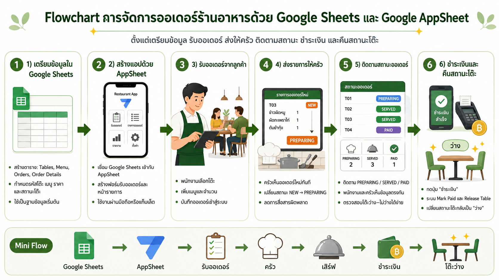

# Week 8 Lab -  แนวทางสร้างระบบสารสนเทศและ Low-code

**เอกสาร Lab :** <a href="W8-LowCodeLab.pdf" target="_blank">W8-LowCodeLab.pdf</a>  
**คู่มือ :** <a href="YOUR_GITHUB_LINK" target="_blank">GitHub</a>  

**การส่งงาน :**
- <a href="YOUR_LOOP_LINK" target="_blank">Microsoft Loop - Project 4 - Automate (ของแต่ละกลุ่ม)</a>
- Save PDF และส่งงานเข้า Mango

# LannaEats App

คู่มือสร้างแอปจัดการออเดอร์ร้านอาหารด้วย **Google Sheets** และ
**Google AppSheet** ตั้งแต่การเตรียมข้อมูล รับออเดอร์ ส่งรายการให้ครัว
ติดตามสถานะ ไปจนถึงชำระเงินและคืนสถานะโต๊ะ

## ความสามารถของระบบ

- ดูและจัดการรายการอาหาร
- เปิดออเดอร์และเลือกเฉพาะโต๊ะที่ว่าง
- เพิ่มอาหารหลายรายการในออเดอร์เดียว
- คำนวณราคาต่อรายการและยอดรวมอัตโนมัติ
- ติดตามสถานะ `NEW → COOKING → READY → SERVED → PAID`
- บันทึกเวลาชำระเงินและคืนสถานะโต๊ะเป็นว่าง

## Workflow

```text
รับออเดอร์
    ↓
เลือกโต๊ะว่างและเพิ่มรายการอาหาร
    ↓
ส่งรายการให้ครัว
    ↓
NEW → COOKING → READY → SERVED
    ↓
ชำระเงิน → PAID
    ↓
บันทึก Paid_DateTime และคืนสถานะโต๊ะเป็นว่าง
```




## คู่มือการสร้างแอป

1. [Step 1: เตรียมโครงสร้าง Google Sheets](Step1-Make%20Google%20Sheet.md)
2. [Step 2: สร้างแอปและ Workflow ใน AppSheet](Step2-Make%20AppSheet.md)

## วิดีโอสาธิต

คลิกภาพตัวอย่างหรือปุ่มด้านล่างเพื่อเปิดวิดีโอและเล่นบน GitHub

### 1. เชื่อมตารางและกำหนด Key

[](assets/L2-1-github.mp4)

[▶️ เล่นวิดีโอบน GitHub](assets/L2-1-github.mp4)

### 2. สร้างหน้า Kitchen และ Workflow การชำระเงิน

[](assets/LO-2-github.mp4)

[▶️ เล่นวิดีโอบน GitHub](assets/LO-2-github.mp4)

> [!NOTE]
> ลิงก์ด้านบนเปิดวิดีโอในหน้าดูไฟล์ของ GitHub หากต้องการให้มี player
> อยู่ภายใน README โดยตรง ต้องอัปโหลดวิดีโอผ่านตัวแก้ไข Markdown บน GitHub
> แล้วใช้ URL รูปแบบ `https://github.com/user-attachments/assets/...`

<details>
<summary>วิธีแสดงวิดีโอเป็น player ภายใน README</summary>

1. เปิด `README.md` บน GitHub แล้วกด **Edit**
2. ลากไฟล์ `assets/L2-1-github.mp4` หรือ `assets/LO-2-github.mp4`
   ไปวางในตัวแก้ไข
3. รอให้ GitHub สร้าง URL แบบ `github.com/user-attachments/assets/...`
4. นำ URL ที่ได้มาใส่ใน README ดังตัวอย่าง

```html
<video src="https://github.com/user-attachments/assets/VIDEO_ID"
       controls
       width="100%">
</video>
```

</details>

## โครงสร้างข้อมูล

ระบบใช้ Google Sheets จำนวน 4 ชีต โดยชื่อคอลัมน์ด้านล่างตรงกับภาพและขั้นตอนในคู่มือ

### `Tables`

| Column | Description | Example |
| --- | --- | --- |
| `Table_ID` | รหัสโต๊ะและ Key | T01 |
| `Table_Name` | ชื่อโต๊ะ | โต๊ะ 1 |
| `Capacity` | จำนวนที่นั่ง | 4 |
| `Table_Status` | สถานะโต๊ะ: `0` = ว่าง, `1` = ไม่ว่าง | 0 |

### `Menu`

| Column | Description | Example |
| --- | --- | --- |
| `Menu_ID` | รหัสเมนูและ Key | M01 |
| `Name_th` | ชื่อเมนูภาษาไทย | ข้าวซอยไก่ |
| `Name_en` | ชื่อเมนูภาษาอังกฤษ | Khao Soi Chicken |
| `Category` | ประเภทเมนู | Food |
| `Price` | ราคา | 69 |
| `Is_Active` | สถานะพร้อมขาย: `0` = ไม่พร้อม, `1` = พร้อม | 1 |
| `Image` | รูปภาพเมนู | khao-soi.jpg |

### `Orders`

| Column | Description | Example |
| --- | --- | --- |
| `Order_ID` | รหัสออเดอร์และ Key | ORD001 |
| `Order_DateTime` | วันที่และเวลาที่สั่ง | 31/08/2026 18:30 |
| `Table_ID` | Ref ไปยัง `Tables` | T01 |
| `Order_Status` | สถานะออเดอร์ | NEW |
| `Total_Amount` | ยอดรวมของออเดอร์ | 167 |
| `Paid_DateTime` | วันที่และเวลาที่ชำระเงิน | 31/08/2026 19:30 |

### `Order_Details`

| Column | Description | Example |
| --- | --- | --- |
| `Detail_ID` | รหัสรายการและ Key | D001 |
| `Order_ID` | Ref ไปยัง `Orders` | ORD001 |
| `Menu_ID` | Ref ไปยัง `Menu` | M01 |
| `Quantity` | จำนวน | 2 |
| `Unit_Price` | ราคาต่อหน่วย | 69 |
| `Total` | ราคารวมของรายการ | 138 |
| `Note` | หมายเหตุ | ไม่ใส่หอม |

