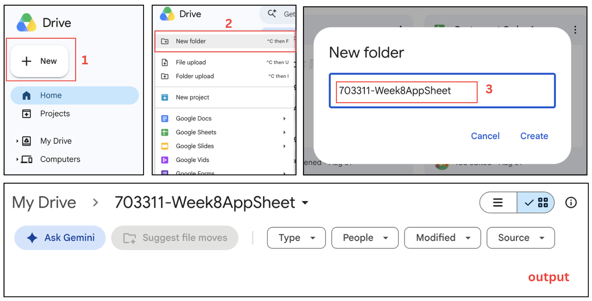
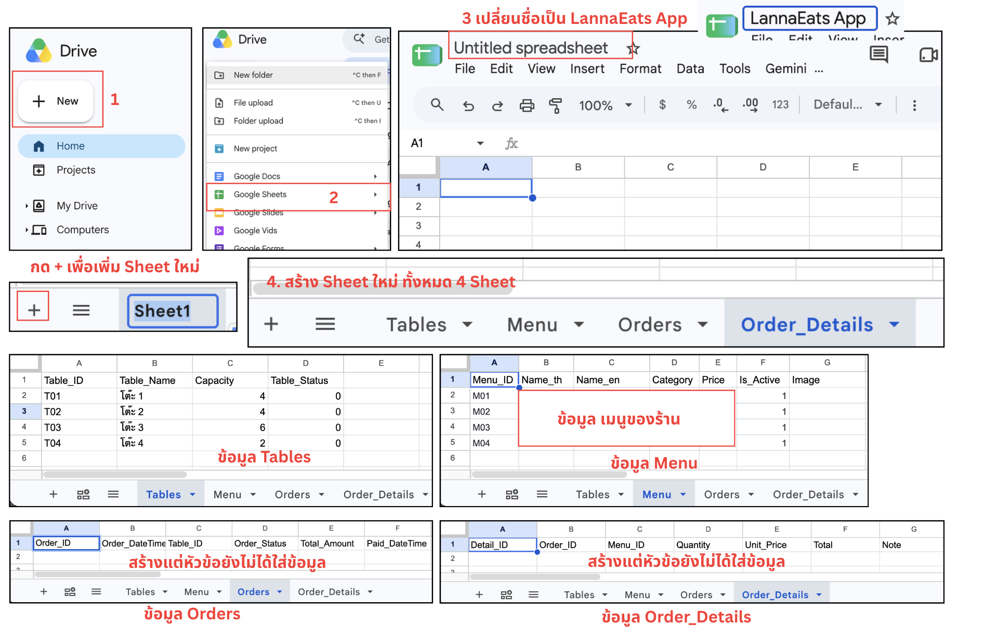

# Step 1: Google Sheet Structure

## Google Sheet Structure
1. ออกแบบระบบโดยใช้ Google Sheets จำนวน 4 ชีต

```text
Google Sheets
│
├── Tables
│   ├── Table_ID
│   ├── Table_Name
│   ├── Capacity
│   └── Table_Status
│
├── Menu
│   ├── Menu_ID
│   ├── Name_th
│   ├── Name_en
│   ├── Category
│   ├── Price
│   ├── Is_Active
│   └── Image
│
├── Orders
│   ├── Order_ID
│   ├── Order_DateTime
│   ├── Table_ID
│   ├── Order_Status
│   ├── Total_Amount
│   └── Paid_DateTime
│
└── Order_Details
    ├── Detail_ID
    ├── Order_ID
    ├── Menu_ID
    ├── Quantity
    ├── Unit_Price
    ├── Total
    └── Note
```

## 1. Sheet: `Tables`

| Column        | Description                     | Example |
| ------------- | ------------------------------- | ------- |
| `Table_ID`    | รหัสโต๊ะ                        | T01     |
| `Table_Name`  | ชื่อโต๊ะ                        | โต๊ะ 1  |
| `Capacity`    | จำนวนที่นั่ง                    | 4       |
| `Table_Status` | สถานะโต๊ะ 0 = ว่าง, 1 = ไม่ว่าง | 0       |

ตัวอย่างข้อมูล

| Table_ID | Table_Name | Capacity | Table_Status |
| -------- | ---------- | -------: | ----------: |
| T01      | โต๊ะ 1     |        4 |           0 |
| T02      | โต๊ะ 2     |        4 |           0 |
| T03      | โต๊ะ 3     |        6 |           0 |
| T04      | โต๊ะ 4     |        2 |           0 |

---

## 2. Sheet: `Menu`

| Column         | Description   | Example     |
| -------------- | ------------- | ----------- |
| `Menu_ID`      | รหัสเมนู      | M01         |
| `Name_th`      | ชื่อเมนูไทย   | ข้าวซอยไก่ |
| `Name_en`      | ชื่อเมนูอังกฤษ | Khao Soi Chicken |
| `Category`     | ประเภทเมนู    | Food        |
| `Price`        | ราคา          | 69          |
| `Is_Active`    | สถานะพร้อมขาย 0 = ไม่พร้อม, 1 = พร้อม | 1 |
| `Image`        | รูปภาพเมนู    | menu01.jpg  |

ตัวอย่างข้อมูล

| Menu_ID | Name_th      | Name_en          | Category | Price | Is_Active | Image |
| ------- | ------------ | ---------------- | -------- | ----: | --------: | ----- |
| M01     | ข้าวซอยไก่   | Khao Soi Chicken | Food     |    69 |         1 |       |
| M02     | ข้าวซอยเนื้อ | Khao Soi Beef    | Food     |    79 |         1 |       |
| M03     | ข้าวซอยเจ    | Vegan Khao Soi   | Food     |    69 |         1 |       |
| M04     | ชาเย็น       | Thai Milk Tea    | Drink    |    29 |         1 |       |

---

## 3. Sheet: `Orders`

| Column           | Description       | Example          |
| ---------------- | ----------------- | ---------------- |
| `Order_ID`       | รหัส Order        | ORD001           |
| `Order_DateTime` | วันที่และเวลาสั่ง | 31/08/2026 18:30 |
| `Table_ID`       | รหัสโต๊ะ          | T01              |
| `Order_Status`   | สถานะ Order       | NEW              |
| `Total_Amount`  | ยอดรวม Order      | 167              |
| `Paid_DateTime` | วันที่และเวลาจ่ายเงิน | 31/08/2026 19:30 |

ตัวอย่างข้อมูล

| Order_ID | Order_DateTime   | Table_ID | Order_Status | Total_Amount | Paid_DateTime |
| -------- | ---------------- | -------- | ------------ | -----------: | ------------- |
| ORD001   | 31/08/2026 18:30 | T01      | NEW          |          167 |               |

สถานะ Order ที่ใช้

```text
NEW
COOKING
READY
SERVED
PAID
```

---

## 4. Sheet: `Order_Details`

| Column       | Description   | Example   |
| ------------ | ------------- | --------- |
| `Detail_ID`  | รหัสรายการ    | D001      |
| `Order_ID`   | รหัส Order    | ORD001    |
| `Menu_ID`    | รหัสเมนู      | M01       |
| `Quantity`   | จำนวน         | 2         |
| `Unit_Price` | ราคาต่อหน่วย  | 69        |
| `Total`      | ราคารวมรายการ | 138       |
| `Note`       | หมายเหตุ      | ไม่ใส่หอม |

ตัวอย่างข้อมูล

| Detail_ID | Order_ID | Menu_ID | Quantity | Unit_Price | Total | Note     |
| --------- | -------- | ------- | -------: | ---------: | ----: | -------- |
| D001      | ORD001   | M01     |        2 |         69 |   138 |          |
| D002      | ORD001   | M04     |        1 |         29 |    29 | หวานน้อย |

---

## วิธีการสร้าง Google Sheet
1. เข้า [Google Drive](https://drive.google.com/drive/home) และลงชื่อเข้าใช้บัญชี Google
2. สร้างโฟลเดอร์ชื่อ `703311-Week8AppSheet`
       - เลือก + New
       - เลือก New Folder
       - ตั้งชื่อโฟลเดอร์ `703311-Week8AppSheet`
   
3. สร้าง Google Sheet ชื่อ `LannaEats App` และเพิ่มให้ครบ 4 ชีต
   
