## 🧭 สารบัญ

กดหัวข้อเพื่อไปยังเนื้อหา
1. [ภาพรวมระบบ](#1-ภาพรวมระบบ)
2. [ขั้นตอนการสร้าง AppSheet](#2-ขั้นตอนการสร้าง-appsheet)
3. [สรุป Data Flow](#สรุป-data-flow)
4. [Business Process ที่ระบบรองรับ](#business-process-ที่ระบบรองรับ)
5. [ผลลัพธ์สุดท้าย](#ผลลัพธ์สุดท้าย)
6. [แชร์ลิงก์สำหรับเข้าใช้งานแอป](#แชร์ลิงก์สำหรับเข้าใช้งานแอป)


# คู่มือสร้างแอป Restaurant Order Management ด้วย Google AppSheet

> **Use Case:** แอปสำหรับพนักงานร้านอาหาร รับออเดอร์จากลูกค้า → ส่งรายการให้ครัว →
> อัปเดตสถานะอาหาร → เช็คบิลและคืนสถานะโต๊ะ\
> **เครื่องมือ:** Google Sheets + Google AppSheet\
> **รูปแบบ:** No-code / Low-code

------------------------------------------------------------------------

## 1. ภาพรวมระบบ

แอปนี้ออกแบบให้พนักงานสามารถทำงานตั้งแต่รับออเดอร์จนถึงชำระเงินในแอปเดียว
โดยแบ่งหน้าหลักเป็น 3 ส่วน

1.  **Menu** --- ดูและจัดการรายการอาหาร
2.  **Order** --- เปิดออเดอร์ เลือกโต๊ะ และเพิ่มรายการอาหาร
3.  **KITCHEN & PAYMENT** --- ครัวดูออเดอร์ อัปเดตสถานะ และพนักงานเช็คบิล

### Workflow

``` text
ลูกค้าเลือกอาหาร
      ↓
พนักงานเปิด Order
      ↓
เลือกโต๊ะว่าง
      ↓
เพิ่มเมนู + จำนวน
      ↓
Save Order
      ↓
โต๊ะเปลี่ยนเป็นไม่ว่าง
      ↓
KITCHEN & PAYMENT
      ↓
NEW → COOKING/READY → SERVED
      ↓
ชำระเงิน
      ↓
PAID + Paid_DateTime
      ↓
คืนโต๊ะเป็นว่าง
```

------------------------------------------------------------------------
## 2. ขั้นตอนการสร้าง AppSheet

### Step 1: สร้าง App

1. เปิด [Google AppSheet](https://www.appsheet.com/home/apps) ด้วยบัญชี Google เดียวกับ Google Sheets
2. สร้าง App: เลือก Create → App → Start with existing data
3. สร้าง App ชื่อ `LannaEats App` และเลือก Other
4. กด Choose your data เพื่อเชื่อม Data Source
5. เลือก Google Sheets → โฟลเดอร์ `703311-Week8AppSheet` → Google Sheet `LannaEats App`
   
---
### Step 2: ตรวจสอบข้อมูลที่เชื่อม Google Sheets และกำหนด Key

1. เลือก DATA → Add Table แล้วเพิ่มอีก 3 ตาราง ได้แก่ `Menu`, `Orders` และ `Order_Details`
   
2. ตรวจสอบและกำหนด Key ของแต่ละ Table

[▶️ ดูวิดีโอ](assets/L2-1-github.mp4)

#### Table: `Menu`

ใช้เก็บรายการอาหาร โดยกำหนด `Menu_ID` เป็น **Key**

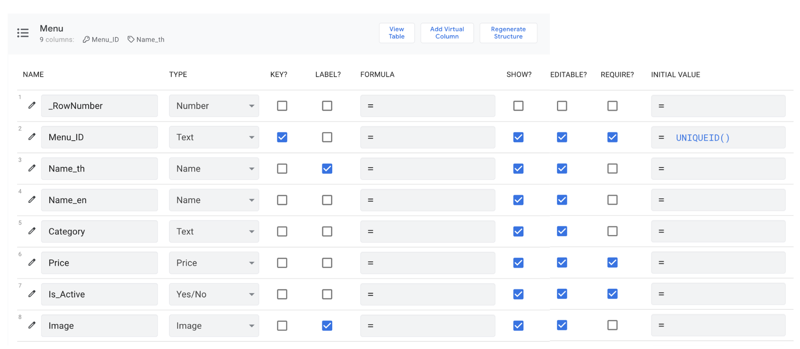
#### Table: `Tables`

- `Table_ID` → Key
- `Table_Name` → Label

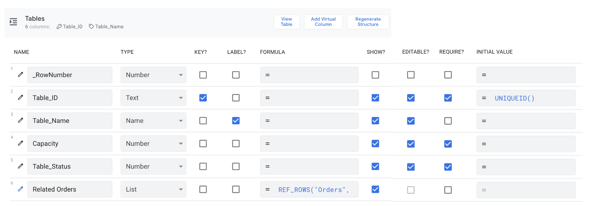

#### Table: `Orders`

ใช้เก็บข้อมูลหัวออเดอร์ โดยตั้งค่าดังนี้

- `Order_ID` → Key
- `Table_ID` → Ref → `Tables`
- `Order_DateTime` → DateTime
- `Order_Status` → Enum
- `Total_Amount` → Price
- `Paid_DateTime` → DateTime


##### ค่าเริ่มต้นของ Order

`Order_ID`

```appsheet
UNIQUEID()
```

`Order_DateTime`

```appsheet
NOW()
```

`Order_Status`

```appsheet
"NEW"
```

> **สำคัญ:** ไม่ใส่ `NOW()` ใน Initial Value ของ `Paid_DateTime`
> เพราะต้องบันทึกเวลานี้เฉพาะตอนชำระเงินจริง

 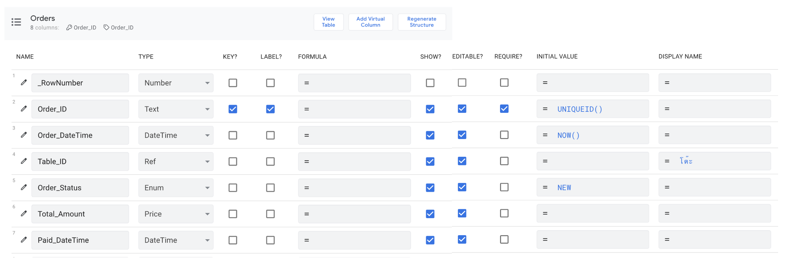

#### Table: `Order_Details`

ใช้เก็บรายการอาหารของแต่ละออเดอร์ โดยตั้งค่าดังนี้

- `Detail_ID` → Key
- `Order_ID` → Ref → `Orders`
- เปิด **Is a part of?** ที่ `Order_ID`
- `Menu_ID` → Ref → `Menu`
- `Quantity` → Number
- `Unit_Price` → Price
- `Total` → Number

การเปิด **Is a part of?** ทำให้พนักงานสามารถเพิ่มรายการอาหารหลายรายการภายใน
Order Form เดียวได้


**หมายเหตุ:** การเปลี่ยนสกุลเงิน

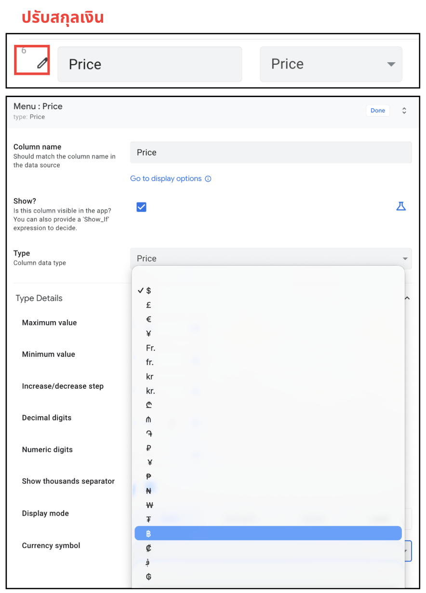

------------------------------------------------------------------------

### Step 3: สร้างหน้า Menu

1.  เลือก UX → New View → Create a new view
2.  ตั้งค่า
   ``` text
      View name: Menu
      For this data: Menu
      View type: Deck
      Group by: Category   (แยกประเภทเมนู)
   ```
3. สามารถแก้ไขเพิ่มข้อมูลและรูปภาพ
   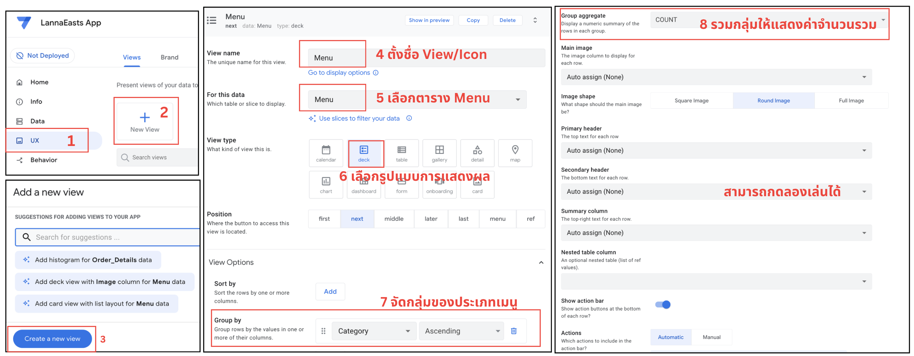

   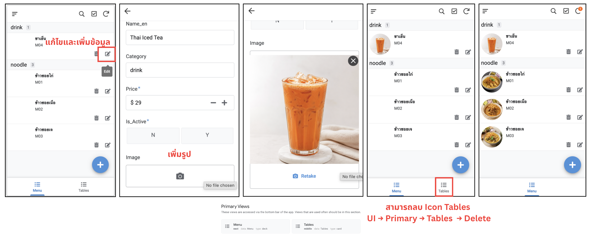
------------------------------------------------------------------------
### Step 4: สร้างหน้า Order
1. เลือก UX → New View → Create a new view
2. ตั้งค่า
   ``` text
      View name: Order
      For this data: Orders
      View type: Table
   ```
    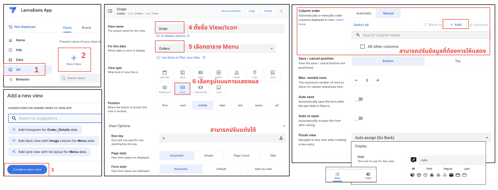
    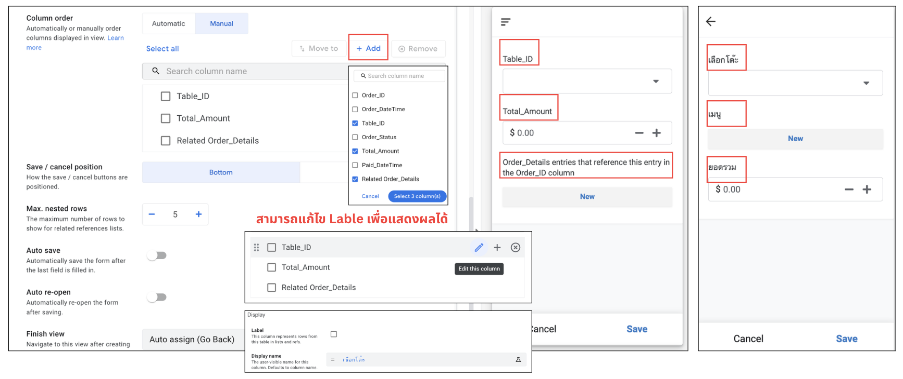

3. คำนวณยอดรวม Order
      ใน Orders[Total_Amount] ใช้รายการลูกของ Order มารวมกัน
      ``` appsheet
      SUM([Related Order_details][Total])
      ```
      
      เมื่อเพิ่มอาหาร เช่น
      
      ``` text
      ข้าวซอยไก่  × 2   = 138
      ชาเย็น      × 1   = 29
      ```
      
      ระบบจะคำนวณ Total Amount ให้อัตโนมัติ
      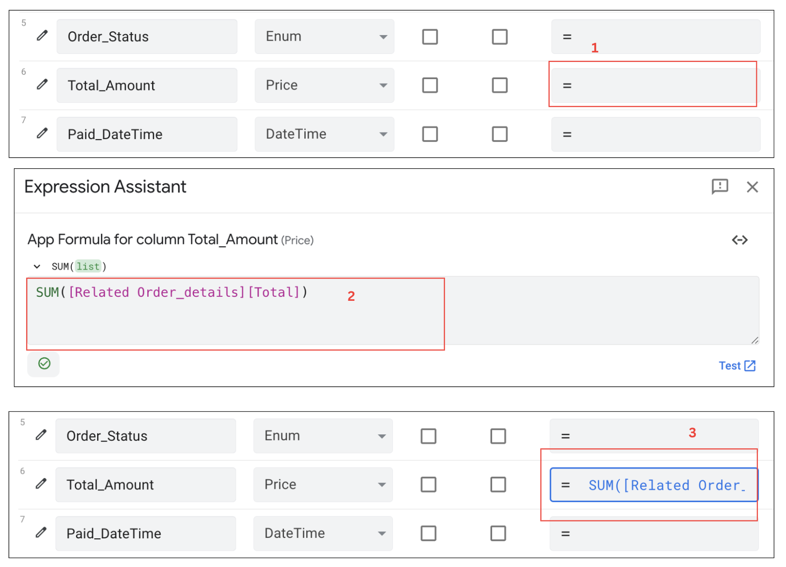

4. คำนวณราคาของแต่ละเมนู
   ใน `Order_Details[Unit_Price]` สามารถดึงราคาจาก Menu

      ตัวอย่าง App Formula:
      
      ``` appsheet
      [Menu_ID].[Price]
      ```
      
      จากนั้นกำหนด `Total`
      
      ``` appsheet
      [Quantity] * [Unit_Price]
      ```
      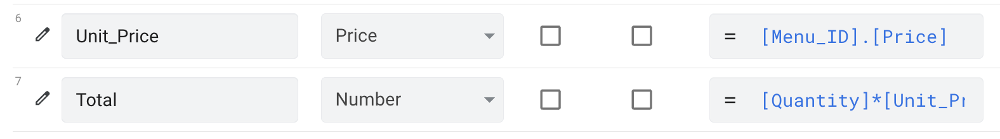

5. เลือกเฉพาะโต๊ะที่ว่าง
**Data → Columns → Orders → Table_ID**
กำหนด `Valid If`
      
``` appsheet
SELECT(
Tables[Table_ID],
[Table_Status] = 0
)
```
      
ผลคือ Dropdown เลือกโต๊ะจะแสดงเฉพาะโต๊ะว่าง
      
ตัวอย่าง:
      
``` text
โต๊ะ 1
โต๊ะ 2
โต๊ะ 3
```
      
หากโต๊ะ 1 ถูกใช้งานแล้ว จะไม่ปรากฏให้ Order ใหม่เลือกซ้ำ

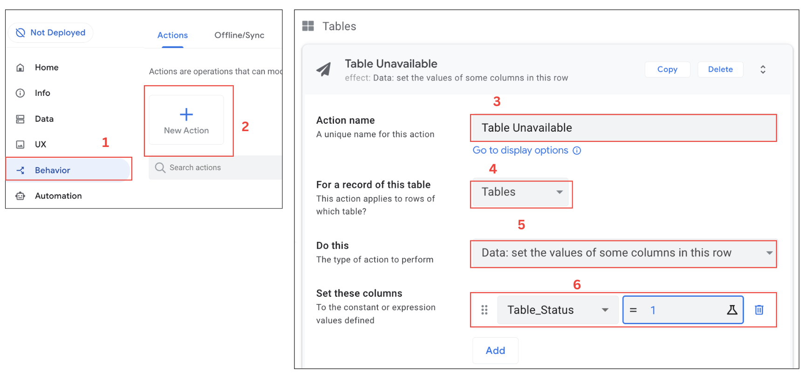

6. เปลี่ยนโต๊ะเป็นไม่ว่างเมื่อรับ Order
      สร้าง Action ที่ Table `Tables`

      ## Action: `Table Unavailable`
      
      ``` text
      For a record of this table:
      Tables
      
      Do this:
      Data: set the values of some columns in this row
      ```
      
      กำหนด:
      
      ``` appsheet
      Table_Status = 1
      ```
      
      จากนั้นสร้าง Action ใน `Orders`
      
      ## Action: `Mark Selected Table Unavailable`
      
      ``` text
      For a record of this table:
      Orders
      
      Do this:
      Data: execute an action on a set of rows
      ```
      
      Referenced Table:
      
      ``` text
      Tables
      ```
      
      Referenced Rows:
      
      ``` appsheet
      LIST([Table_ID])
      ```
      
      Referenced Action:
      
      ``` text
      Table Unavailable
      ```
      
      นำ Action นี้ไปกำหนดให้ทำงานหลัง Save Order
      
      ``` text
      Orders_Form
      → Behavior
      → Event Actions
      → Form Saved
      → Mark Selected Table Unavailable
      ```
      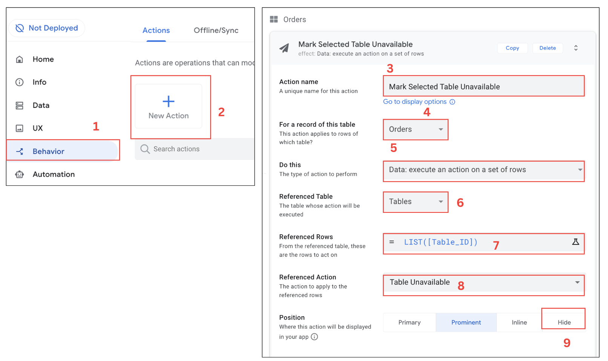

      **เพิ่ม Action ใน View ของ Order**
          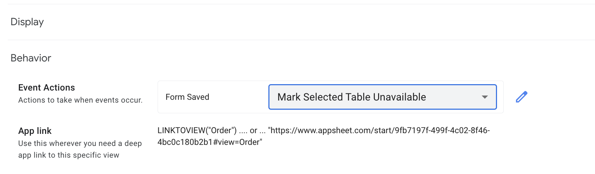

7.  ปรับรูปการแสดงผลของ Order Detail
   
     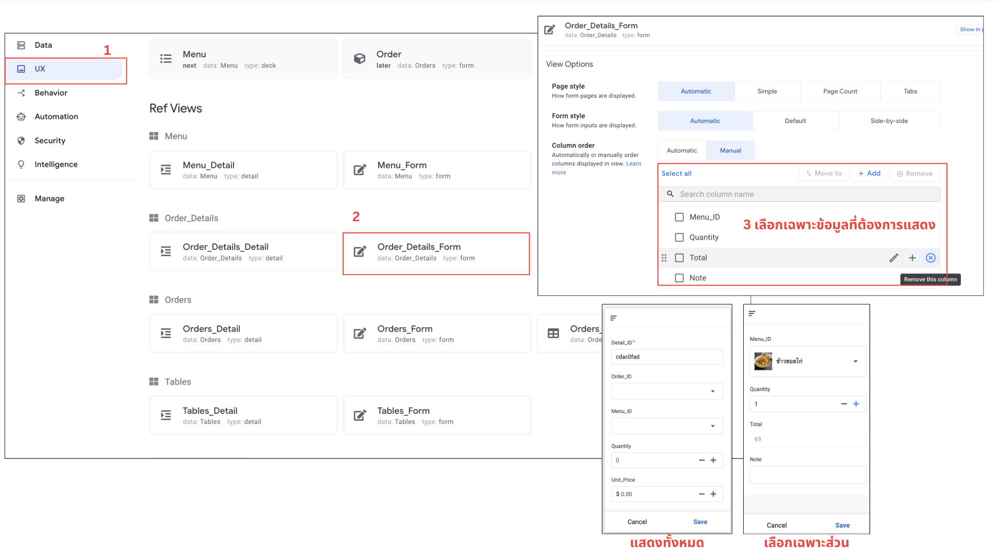
    
**Output Step 4**

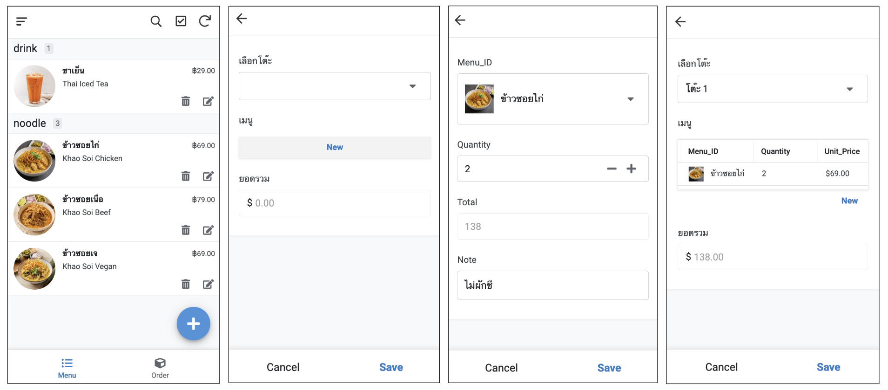
    


      
      
------------------------------------------------------------------------

### Step 5: สร้าง Active Orders
ไม่ต้องการให้ Order ที่จ่ายเงินแล้วอยู่ในหน้าครัว จึงสร้าง Slice

ไปที่:

**Data → Slices → New Slice**

ตั้งชื่อ:

``` text
Active_Orders
```

Source Table:

``` text
Orders
```

Row filter condition:

``` appsheet
[Order_Status] <> "PAID"
```

ดังนั้นเมื่อ Order กลายเป็น `PAID` จะหายออกจากหน้ารายการงานปัจจุบัน

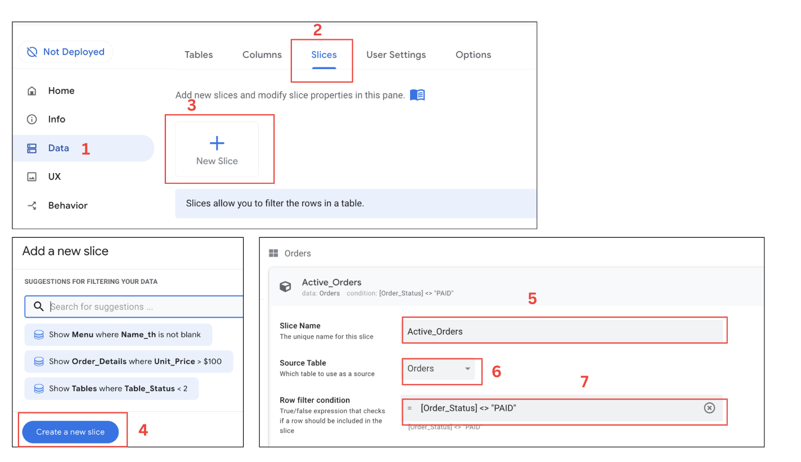

------------------------------------------------------------------------
### Step 6: สร้างหน้า KITCHEN & PAYMENT

**1. สร้าง View:**

``` text
View name:
KITCHEN & PAYMENT

For this data:
Active_Orders

View type:
Table
```

แนะนำให้ Group by:

``` text
Table_ID
```

และแสดงข้อมูล:

``` text
Order_Status
Order_DateTime
Total_Amount
```

ตัวอย่าง:

``` text
โต๊ะ 1      ฿138
   SERVED   12:56

โต๊ะ 2      ฿196
   NEW      13:02
```
                  

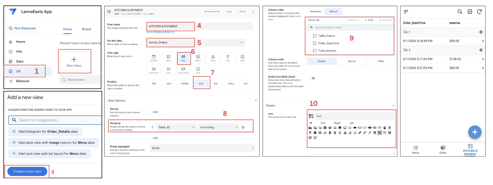


**2. สร้าง Dropdown สถานะ Order**

ไปที่

**Data → Columns → Orders → Order_Status**

ตั้ง:

``` text
Type       = Enum
Base type  = Text
Input mode = Dropdown
Editable?  = ON
```

Values ตัวอย่าง:

``` text
NEW
COOKING
READY
SERVED
PAID
```

หรือปรับ Workflow ให้เหมาะกับร้าน เช่น

``` text
NEW → PREPARING → SERVED → PAID
```

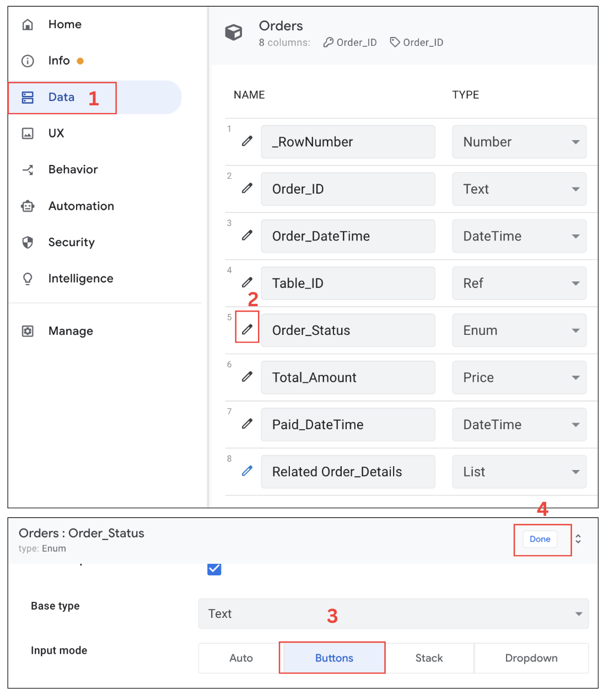

**3. ให้แก้สถานะจากหน้า Detail**

ไปที่

**UX → Views → Active_Orders_Detail**

เพิ่ม `Order_Status` ใน **Quick Edit Columns**

พนักงานครัวจึงสามารถกด Dropdown แล้วเปลี่ยนสถานะ เช่น

``` text
NEW
  ↓
COOKING
  ↓
READY
  ↓
SERVED
```
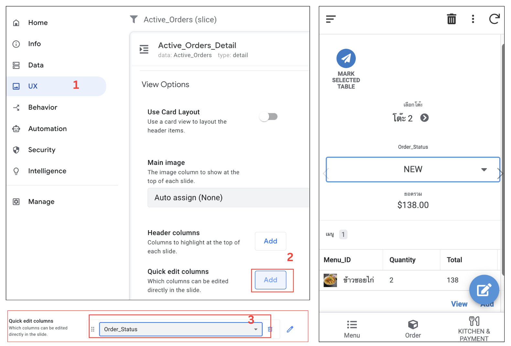

**4. สร้างปุ่ม "ชำระเงิน"**

ไม่แนะนำให้พนักงานเลือก `PAID` ด้วย Dropdown โดยตรง
เพราะตอนชำระเงินระบบต้องทำหลายอย่างพร้อมกัน:

1.  เปลี่ยนสถานะเป็น `PAID`
2.  บันทึก `Paid_DateTime`
3.  คืนสถานะโต๊ะเป็นว่าง

จึงสร้าง Action สำหรับ Payment


**5.  Action: `Mark Paid`**

Table:

``` text
Orders
```

Do this:

``` text
Data: set the values of some columns in this row
```

Set:

``` appsheet
Order_Status = "PAID"
```

``` appsheet
Paid_DateTime = NOW()
```

Only if:

``` appsheet
[Order_Status] = "SERVED"
```
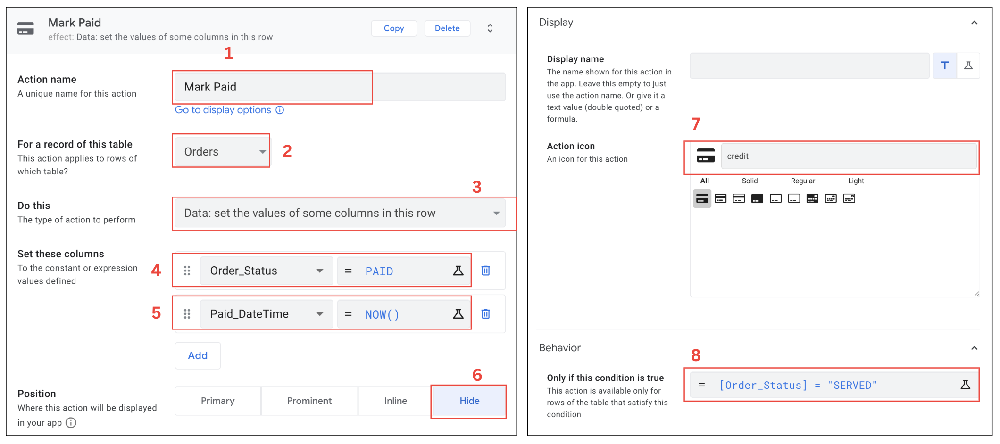


**6. Action: `Table Available`**

Table:

``` text
Tables
```

Do this:

``` text
Data: set the values of some columns in this row
```

Set:

``` appsheet
Table_Status = 0
```
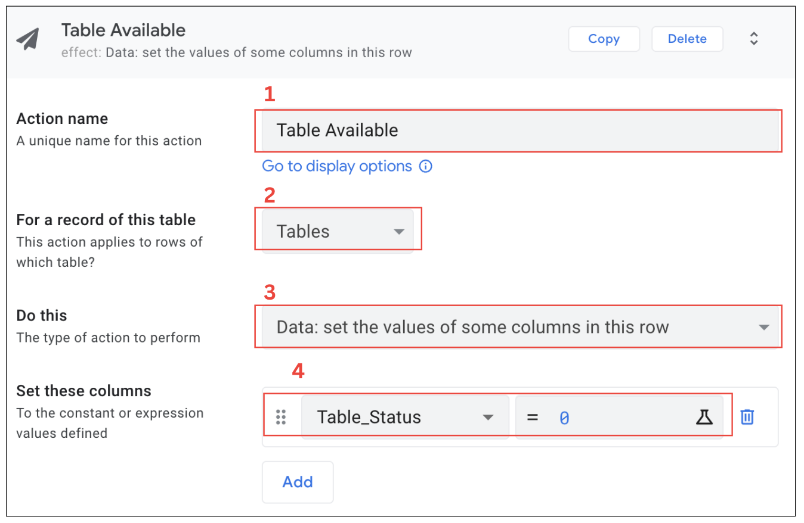 


**7. Action: `Release Table`**

Table:

``` text
Orders
```

Do this:

``` text
Data: execute an action on a set of rows
```

Referenced Table:

``` text
Tables
```

Referenced Rows:

``` appsheet
LIST([Table_ID])
```

Referenced Action:

``` text
Table Available
```
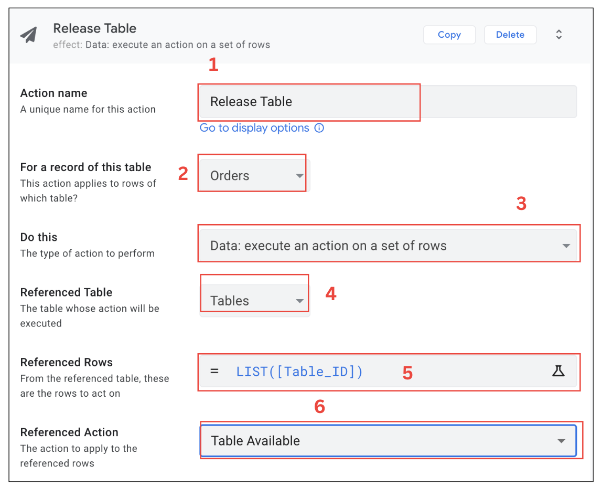

**8. Grouped Action: `Payment`**

สร้าง Action:

``` text
Action name: Payment
For a record of this table: Orders
Do this: Grouped: execute a sequence of actions
```

Actions:

``` text
1. Mark Paid
2. Release Table
```

ตั้ง Display name:

``` text
ชำระเงิน
```

เลือก Icon เช่น:

``` text
credit-card
```

Position:

``` text
Prominent
```

Only if:

``` appsheet
[Order_Status] = "SERVED"
```

ดังนั้นปุ่ม **ชำระเงิน** จะปรากฏเฉพาะ Order ที่เสิร์ฟแล้ว

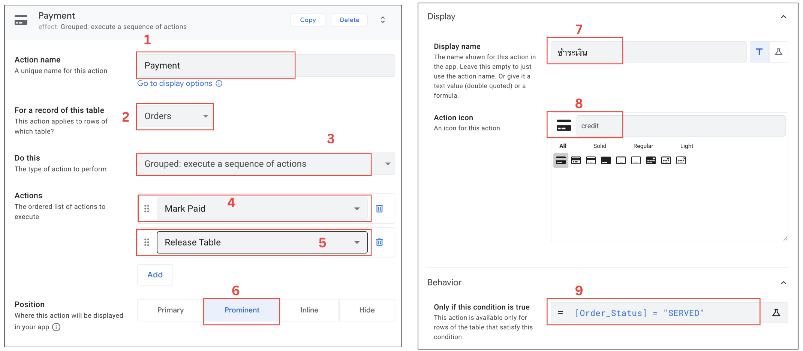

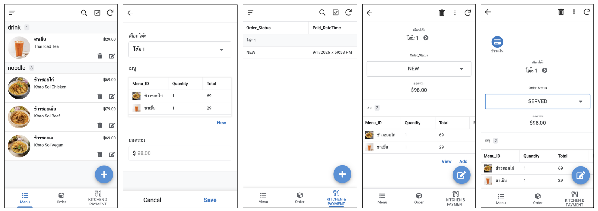


[▶️ ดูวิดีโอ](assets/LO-2-github.mp4)

------------------------------------------------------------------------

### Step 7: Workflow การชำระเงิน

เมื่อพนักงานกด

``` text
💳 ชำระเงิน
```

Grouped Action จะทำงาน:

``` text
Payment
   │
   ├── Mark Paid
   │      ├── Order_Status = PAID
   │      └── Paid_DateTime = NOW()
   │
   └── Release Table
          └── Table_Status = 0
```

จากนั้น:

``` text
Order_Status = PAID
       ↓
ไม่ผ่าน Active_Orders filter
       ↓
Order หายจาก KITCHEN & PAYMENT
```

และ

``` text
Table_Status = 0
       ↓
โต๊ะกลับมาอยู่ใน Dropdown
       ↓
รับลูกค้ารอบใหม่ได้
```

------------------------------------------------------------------------

## สรุป Data Flow

``` text
                 ┌─────────────┐
                 │    Menu     │
                 └──────┬──────┘
                        │ Ref
                        ▼
Customer → Staff → Order_Details
                        │
                        ▼
                    Orders
                  /    │     \
                 /     │      \
                ▼      ▼       ▼
             Tables  Kitchen  Payment
                │      │       │
                │      ▼       ▼
                │   Status    PAID
                │               │
                └───────────────┘
                    Release Table
```

------------------------------------------------------------------------

## Business Process ที่ระบบรองรับ

ระบบนี้ไม่ได้เป็นเพียงหน้ารับ Order แต่เป็น Workflow เชื่อมงานหน้าร้าน ครัว
และการชำระเงิน

``` text
Order Taking
     ↓
Order Processing
     ↓
Kitchen Preparation
     ↓
Order Status Tracking
     ↓
Serving
     ↓
Billing / Payment
     ↓
Table Release
```

จึงช่วยลดปัญหา เช่น

-   รับ Order แล้วตกหล่น
-   ครัวไม่ทราบว่า Order ใดเข้าก่อน
-   ใช้โต๊ะซ้ำในขณะที่ลูกค้ายังไม่ชำระเงิน
-   พนักงานไม่ทราบสถานะอาหาร
-   ไม่มีเวลาชำระเงินที่ชัดเจน
-   Order ที่จบแล้วปะปนกับ Order ที่กำลังดำเนินการ

------------------------------------------------------------------------


## ผลลัพธ์สุดท้าย

แอป AppSheet จะรองรับกระบวนการร้านอาหารแบบครบวงจร:

**รับออเดอร์ → เลือกโต๊ะ → เพิ่มอาหาร → ส่งเข้าครัว → ติดตามสถานะ → เสิร์ฟ → เช็คบิล →
ชำระเงิน → คืนโต๊ะ**

เหมาะสำหรับใช้เป็นตัวอย่างการพัฒนา **No-code Business Application** ที่เชื่อม
Data, Business Rules, Workflow และ User Interface เข้าด้วยกัน

------------------------------------------------------------------------


## แชร์ลิงก์สำหรับเข้าใช้งานแอป
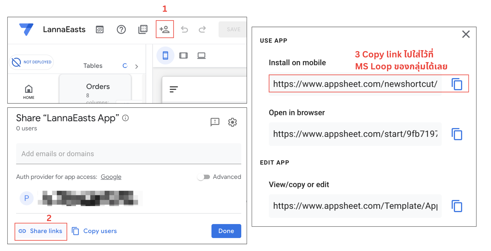
