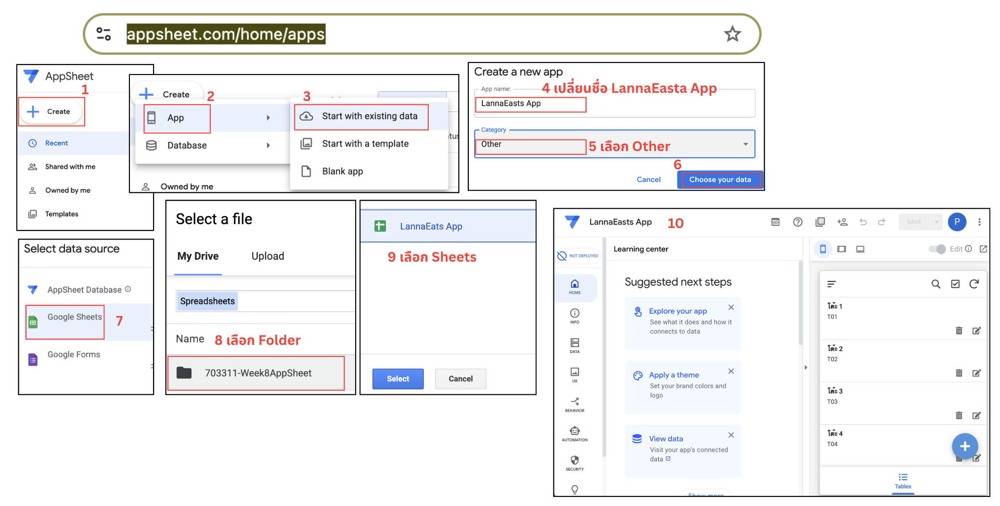
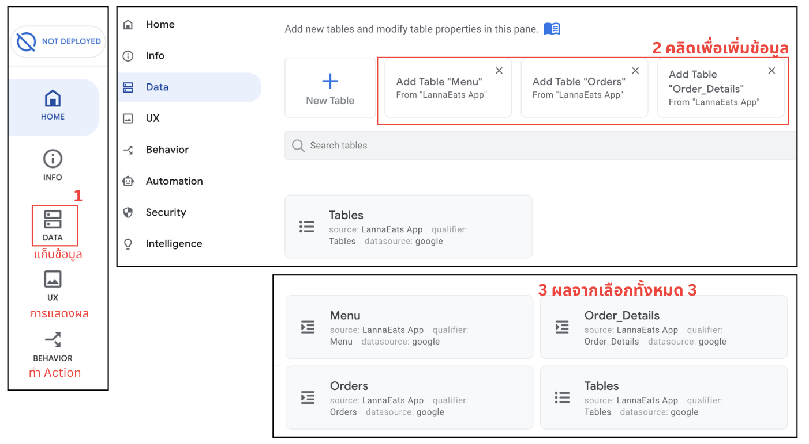

## 🧭 Guideline / สารบัญ

กดหัวข้อเพื่อไปยังเนื้อหา
1. [ภาพรวมระบบ](#1-ภาพรวมระบบ)
2. [เตรียม Google Sheets](#2-เตรียม-google-sheets)
3. [เชื่อม Google Sheets กับ AppSheet](#3-เชื่อม-google-sheets-กับ-appsheet)
4. [สร้างความสัมพันธ์ระหว่างตาราง](#4-สร้างความสัมพันธ์ระหว่างตาราง)
5. [คำนวณราคาของแต่ละเมนู](#5-คำนวณราคาของแต่ละเมนู)
6. [คำนวณยอดรวม Order](#6-คำนวณยอดรวม-order)
7. [สร้างหน้า Menu](#7-สร้างหน้า-menu)
8. [สร้าง Order Form](#8-สร้าง-order-form)
9. [เลือกเฉพาะโต๊ะที่ว่าง](#9-เลือกเฉพาะโต๊ะที่ว่าง)
10. [เปลี่ยนโต๊ะเป็นไม่ว่างเมื่อรับ Order](#10-เปลี่ยนโต๊ะเป็นไม่ว่างเมื่อรับ-order)
11. [สร้าง Active Orders](#11-สร้าง-active-orders)
12. [สร้างหน้า KITCHEN & PAYMENT](#12-สร้างหน้า-kitchen-payment)
13. [สร้าง Dropdown สถานะ Order](#13-สร้าง-dropdown-สถานะ-order)
14. [ให้แก้สถานะจากหน้า Detail](#14-ให้แก้สถานะจากหน้า-detail)
15. [สร้างปุ่ม "ชำระเงิน"](#15-สร้างปุ่ม-ชำระเงิน)
16. [Workflow การชำระเงิน](#16-workflow-การชำระเงิน)
17. [การทำงานจริงของพนักงาน](#17-การทำงานจริงของพนักงาน)
18. [สรุป Data Flow](#18-สรุป-data-flow)
19. [Business Process ที่ระบบรองรับ](#19-business-process-ที่ระบบรองรับ)
20. [Checklist ก่อนใช้งานจริง](#20-checklist-ก่อนใช้งานจริง)

# คู่มือสร้างแอป Restaurant Order Management ด้วย Google AppSheet

> **Use Case:** แอปสำหรับพนักงานร้านอาหาร รับออเดอร์จากลูกค้า → ส่งรายการให้ครัว →
> อัปเดตสถานะอาหาร → เช็คบิลและคืนสถานะโต๊ะ\
> **เครื่องมือ:** Google Sheets + Google AppSheet\
> **รูปแบบ:** No-code / Low-code

------------------------------------------------------------------------

## 1. ภาพรวมระบบ

แอปนี้ออกแบบให้พนักงานสามารถทำงานตั้งแต่รับออเดอร์จนถึงชำระเงินในแอปเดียว
โดยแบ่งหน้าหลักเป็น 3 ส่วน

1.  **Menu** --- ดูและจัดการรายการอาหาร
2.  **Order** --- เปิดออเดอร์ เลือกโต๊ะ และเพิ่มรายการอาหาร
3.  **KITCHEN & PAYMENT** --- ครัวดูออเดอร์ อัปเดตสถานะ และพนักงานเช็คบิล

### Workflow

``` text
ลูกค้าเลือกอาหาร
      ↓
พนักงานเปิด Order
      ↓
เลือกโต๊ะว่าง
      ↓
เพิ่มเมนู + จำนวน
      ↓
Save Order
      ↓
โต๊ะเปลี่ยนเป็นไม่ว่าง
      ↓
KITCHEN & PAYMENT
      ↓
NEW → COOKING/READY → SERVED
      ↓
ชำระเงิน
      ↓
PAID + Paid_Time
      ↓
คืนโต๊ะเป็นว่าง
```

------------------------------------------------------------------------
# 2. ขั้นตอนการสร้าง AppSheet
## Step 1 : สร้าง App
1. เปิด [Google AppSheet](https://www.appsheet.com/home/apps) ด้วย Account Google เดียวกับ Google Sheets
2. สร้าง App : เลือก Create -> App -> Start with existing data
3. สร้าง App ชื่อ `LannaEats App` และเลือก Other
4. กดเลือก Choose your data เพื่อเชื่อม data source
5. เลือก Data Source : Google Sheets -> เลือก Folder 703311-Week8AppSheet -> เลือก Google Sheets LannaEats App
   
---
## Step 2 : ตรวจสอบข้อมูลที่เชื่อม Google Sheets และกำหนด Key
1. เลือก DATA -> click เลือก Add Table ทั้ง 3 Table
   
2. ตรวจสอบและกำหนด Key ของแต่ละ Table
   
   **Table: `Menu`** ใช้เก็บรายการอาหาร
   
   แนะนำให้กำหนด `Menu_ID` เป็น **Key**
   
   **Table: `Tables`** ใช้เก็บข้อมูลโต๊ะ
      -   `Table_ID` → Key
      -   `Table_Name` → Label
          
   **Table: `Orders`** เก็บข้อมูลหัวออเดอร์
      ตั้งค่า:
      
      -   `Order_ID` → Key
      -   `Table_ID` → Ref → `Tables`
      -   `Order_Time` → DateTime
      -   `Order_Status` → Enum
      -   `Total_Amount` → Price
      -   `Paid_Time` → DateTime
      -   ### ค่าเริ่มต้นของ Order

      `Order_ID`
      
      ``` appsheet
      UNIQUEID()
      ```
      
      `Order_Time`
      
      ``` appsheet
      NOW()
      ```
      
      `Order_Status`
      
      ``` appsheet
      "NEW"
      ```
      
      > **สำคัญ:** ไม่ใส่ `NOW()` ใน Initial Value ของ `Paid_Time`
      > เพราะต้องบันทึกเวลานี้เฉพาะตอนชำระเงินจริง
      
     **Table: `Orders`** เก็บข้อมูลหัวออเดอร์
         ตั้งค่า:
      
      -   `Detail_ID` → Key
      -   `Order_ID` → Ref → `Orders`
      -   เปิด **Is a part of?** ที่ `Order_ID`
      -   `Menu_ID` → Ref → `Menu`
      -   `Quantity` → Number
      -   `Unit_Price` → Price
      -   `Subtotal` → Price
      
      การเปิด **Is a part of?** ทำให้พนักงานสามารถเพิ่มรายการอาหารหลายรายการภายใน
      Order Form เดียวได้


------------------------------------------------------------------------

# 3. เชื่อม Google Sheets กับ AppSheet

1.  เปิด AppSheet
2.  เลือก **Create → App → Start with existing data**
3.  เลือก Google Sheets ที่เตรียมไว้
4.  เพิ่ม Table:
    -   `Menu`
    -   `Tables`
    -   `Orders`
    -   `Order_details`
5.  ตรวจสอบชนิดข้อมูลใน **Data → Columns**

------------------------------------------------------------------------

# 4. สร้างความสัมพันธ์ระหว่างตาราง

โครงสร้างความสัมพันธ์คือ

``` text
Tables
   │
   └── Orders
          │
          └── Order_details
                    │
                    └── Menu
```

กำหนด Ref:

``` text
Orders[Table_ID]
       → Tables

Order_details[Order_ID]
       → Orders

Order_details[Menu_ID]
       → Menu
```

เมื่อสร้าง Ref ถูกต้อง AppSheet จะสร้าง Reverse Reference เช่น

``` text
Related Orders
Related Order_details
```

ให้อัตโนมัติ

------------------------------------------------------------------------

# 5. คำนวณราคาของแต่ละเมนู

ใน `Order_details[Unit_Price]` สามารถดึงราคาจาก Menu

ตัวอย่าง App Formula:

``` appsheet
[Menu_ID].[Price]
```

จากนั้น `Subtotal`

``` appsheet
[Quantity] * [Unit_Price]
```

------------------------------------------------------------------------

# 6. คำนวณยอดรวม Order

ใน `Orders[Total_Amount]` ใช้รายการลูกของ Order มารวมกัน

``` appsheet
SUM([Related Order_details][Subtotal])
```

เมื่อเพิ่มอาหาร เช่น

``` text
ข้าวซอยไก่  × 2   = 138
ชาเย็น      × 1   = 29
```

ระบบจะคำนวณ Total Amount ให้อัตโนมัติ

------------------------------------------------------------------------

# 7. สร้างหน้า Menu

สร้าง View จาก Table `Menu`

แนะนำ:

``` text
View name: Menu
For this data: Menu
View type: Deck
```

ตั้ง Group by:

``` text
Category
```

จะแสดงเมนูแยกประเภท เช่น

``` text
drink
  ชาเย็น

noodle
  ข้าวซอยเจ
  ข้าวซอยเนื้อ
  ข้าวซอยไก่
```

แนะนำให้แสดง:

-   รูปอาหาร
-   ชื่อเมนู
-   ชื่อภาษาอังกฤษ
-   ราคา

------------------------------------------------------------------------

# 8. สร้าง Order Form

หน้า `Orders_Form` ใช้สำหรับพนักงานเปิดออเดอร์

จัด Column Order ประมาณ:

``` text
Table_ID
Related Order_details
Total_Amount
```

ไม่จำเป็นต้องให้พนักงานกรอก:

``` text
Order_ID
Order_Time
Order_Status
Paid_Time
```

เพราะระบบจัดการให้อัตโนมัติ

------------------------------------------------------------------------

# 9. เลือกเฉพาะโต๊ะที่ว่าง

ที่

**Data → Columns → Orders → Table_ID**

กำหนด `Valid If`

``` appsheet
SELECT(
  Tables[Table_ID],
  [Table_Status] = 0
)
```

ผลคือ Dropdown เลือกโต๊ะจะแสดงเฉพาะโต๊ะว่าง

ตัวอย่าง:

``` text
โต๊ะ 1
โต๊ะ 2
โต๊ะ 3
```

หากโต๊ะ 1 ถูกใช้งานแล้ว จะไม่ปรากฏให้ Order ใหม่เลือกซ้ำ

------------------------------------------------------------------------

# 10. เปลี่ยนโต๊ะเป็นไม่ว่างเมื่อรับ Order

สร้าง Action ที่ Table `Tables`

## Action: `Table Unavailable`

``` text
For a record of this table:
Tables

Do this:
Data: set the values of some columns in this row
```

กำหนด:

``` appsheet
Table_Status = 1
```

จากนั้นสร้าง Action ใน `Orders`

## Action: `Mark Selected Table Unavailable`

``` text
For a record of this table:
Orders

Do this:
Data: execute an action on a set of rows
```

Referenced Table:

``` text
Tables
```

Referenced Rows:

``` appsheet
LIST([Table_ID])
```

Referenced Action:

``` text
Table Unavailable
```

นำ Action นี้ไปกำหนดให้ทำงานหลัง Save Order

``` text
Orders_Form
→ Behavior
→ Event Actions
→ Form Saved
→ Mark Selected Table Unavailable
```

------------------------------------------------------------------------

# 11. สร้าง Active Orders

ไม่ต้องการให้ Order ที่จ่ายเงินแล้วอยู่ในหน้าครัว จึงสร้าง Slice

ไปที่:

**Data → Slices → New Slice**

ตั้งชื่อ:

``` text
Active_Orders
```

Source Table:

``` text
Orders
```

Row filter condition:

``` appsheet
[Order_Status] <> "PAID"
```

ดังนั้นเมื่อ Order กลายเป็น `PAID` จะหายออกจากหน้ารายการงานปัจจุบัน

------------------------------------------------------------------------

# 12. สร้างหน้า KITCHEN & PAYMENT

สร้าง View:

``` text
View name:
KITCHEN & PAYMENT

For this data:
Active_Orders

View type:
Table
```

แนะนำให้ Group by:

``` text
Table_ID
```

และแสดงข้อมูล:

``` text
Order_Status
Order_Time
Total_Amount
```

ตัวอย่าง:

``` text
โต๊ะ 1      ฿138
   SERVED   12:56

โต๊ะ 2      ฿196
   NEW      13:02
```

------------------------------------------------------------------------

# 13. สร้าง Dropdown สถานะ Order

ไปที่

**Data → Columns → Orders → Order_Status**

ตั้ง:

``` text
Type       = Enum
Base type  = Text
Input mode = Dropdown
Editable?  = ON
```

Values ตัวอย่าง:

``` text
NEW
COOKING
READY
SERVED
PAID
```

หรือปรับ Workflow ให้เหมาะกับร้าน เช่น

``` text
NEW → PREPARING → SERVED → PAID
```

------------------------------------------------------------------------

# 14. ให้แก้สถานะจากหน้า Detail

ไปที่

**UX → Views → Active_Orders_Detail**

เพิ่ม `Order_Status` ใน **Quick Edit Columns**

พนักงานครัวจึงสามารถกด Dropdown แล้วเปลี่ยนสถานะ เช่น

``` text
NEW
  ↓
COOKING
  ↓
READY
  ↓
SERVED
```

------------------------------------------------------------------------

# 15. สร้างปุ่ม "ชำระเงิน"

ไม่แนะนำให้พนักงานเลือก `PAID` ด้วย Dropdown โดยตรง
เพราะตอนชำระเงินระบบต้องทำหลายอย่างพร้อมกัน:

1.  เปลี่ยนสถานะเป็น `PAID`
2.  บันทึก `Paid_Time`
3.  คืนสถานะโต๊ะเป็นว่าง

จึงสร้าง Action สำหรับ Payment

------------------------------------------------------------------------

## 15.1 Action: `Mark Paid`

Table:

``` text
Orders
```

Do this:

``` text
Data: set the values of some columns in this row
```

Set:

``` appsheet
Order_Status = "PAID"
```

``` appsheet
Paid_Time = NOW()
```

Only if:

``` appsheet
[Order_Status] = "SERVED"
```

------------------------------------------------------------------------

## 15.2 Action: `Table Available`

Table:

``` text
Tables
```

Do this:

``` text
Data: set the values of some columns in this row
```

Set:

``` appsheet
Table_Status = 0
```

------------------------------------------------------------------------

## 15.3 Action: `Release Table`

Table:

``` text
Orders
```

Do this:

``` text
Data: execute an action on a set of rows
```

Referenced Table:

``` text
Tables
```

Referenced Rows:

``` appsheet
LIST([Table_ID])
```

Referenced Action:

``` text
Table Available
```

------------------------------------------------------------------------

## 15.4 Grouped Action: `Payment`

สร้าง Action:

``` text
Action name: Payment
For a record of this table: Orders
Do this: Grouped: execute a sequence of actions
```

Actions:

``` text
1. Mark Paid
2. Release Table
```

ตั้ง Display name:

``` text
ชำระเงิน
```

เลือก Icon เช่น:

``` text
credit-card
```

Position:

``` text
Prominent
```

Only if:

``` appsheet
[Order_Status] = "SERVED"
```

ดังนั้นปุ่ม **ชำระเงิน** จะปรากฏเฉพาะ Order ที่เสิร์ฟแล้ว

------------------------------------------------------------------------

# 16. Workflow การชำระเงิน

เมื่อพนักงานกด

``` text
💳 ชำระเงิน
```

Grouped Action จะทำงาน:

``` text
Payment
   │
   ├── Mark Paid
   │      ├── Order_Status = PAID
   │      └── Paid_Time = NOW()
   │
   └── Release Table
          └── Table_Status = 0
```

จากนั้น:

``` text
Order_Status = PAID
       ↓
ไม่ผ่าน Active_Orders filter
       ↓
Order หายจาก KITCHEN & PAYMENT
```

และ

``` text
Table_Status = 0
       ↓
โต๊ะกลับมาอยู่ใน Dropdown
       ↓
รับลูกค้ารอบใหม่ได้
```

------------------------------------------------------------------------

# 17. การทำงานจริงของพนักงาน

## ขั้นตอนที่ 1 --- รับ Order

พนักงานกดเมนู

``` text
Order → +
```

เลือกโต๊ะ เช่น

``` text
โต๊ะ 2
```

------------------------------------------------------------------------

## ขั้นตอนที่ 2 --- เพิ่มอาหาร

กด **New** ในรายการเมนูภายใน Order

เลือก:

``` text
เมนู: ข้าวซอยไก่
จำนวน: 1
```

สามารถเพิ่มหลายรายการใน Order เดียวได้

------------------------------------------------------------------------

## ขั้นตอนที่ 3 --- บันทึก Order

ตรวจสอบ:

``` text
โต๊ะ 2

เมนู
ข้าวซอยไก่    1    ฿69

ราคารวม
฿69
```

กด **Save**

ระบบจะ:

``` text
สร้าง Order
+
บันทึกเวลา
+
สถานะ NEW
+
Table_Status = 1
```

------------------------------------------------------------------------

## ขั้นตอนที่ 4 --- ครัวรับ Order

เปิด

``` text
KITCHEN & PAYMENT
```

ครัวจะเห็นเฉพาะ Active Orders และรายการอาหารแยกตามโต๊ะ

เปลี่ยนสถานะ:

``` text
NEW → COOKING → READY → SERVED
```

------------------------------------------------------------------------

## ขั้นตอนที่ 5 --- เช็คบิล

เมื่อสถานะเป็น

``` text
SERVED
```

ระบบแสดงปุ่ม

``` text
💳 ชำระเงิน
```

พนักงานตรวจยอดและกดปุ่ม

ระบบจะ:

``` text
Order_Status → PAID
Paid_Time → NOW()
Table_Status → 0
```

Order หายจากหน้าครัว และโต๊ะพร้อมรับลูกค้ารอบใหม่

------------------------------------------------------------------------

# 18. สรุป Data Flow

``` text
                 ┌─────────────┐
                 │    Menu     │
                 └──────┬──────┘
                        │ Ref
                        ▼
Customer → Staff → Order_details
                        │
                        ▼
                    Orders
                  /    │     \
                 /     │      \
                ▼      ▼       ▼
             Tables  Kitchen  Payment
                │      │       │
                │      ▼       ▼
                │   Status    PAID
                │               │
                └───────────────┘
                    Release Table
```

------------------------------------------------------------------------

# 19. Business Process ที่ระบบรองรับ

ระบบนี้ไม่ได้เป็นเพียงหน้ารับ Order แต่เป็น Workflow เชื่อมงานหน้าร้าน ครัว
และการชำระเงิน

``` text
Order Taking
     ↓
Order Processing
     ↓
Kitchen Preparation
     ↓
Order Status Tracking
     ↓
Serving
     ↓
Billing / Payment
     ↓
Table Release
```

จึงช่วยลดปัญหา เช่น

-   รับ Order แล้วตกหล่น
-   ครัวไม่ทราบว่า Order ใดเข้าก่อน
-   ใช้โต๊ะซ้ำในขณะที่ลูกค้ายังไม่ชำระเงิน
-   พนักงานไม่ทราบสถานะอาหาร
-   ไม่มีเวลาชำระเงินที่ชัดเจน
-   Order ที่จบแล้วปะปนกับ Order ที่กำลังดำเนินการ

------------------------------------------------------------------------

# 20. Checklist ก่อนใช้งานจริง

ตรวจสอบให้ครบ:

-   [ ] `Menu_ID`, `Table_ID`, `Order_ID`, `Detail_ID` มี Key ที่ไม่ซ้ำ
-   [ ] `Orders[Table_ID]` เป็น Ref → `Tables`
-   [ ] `Order_details[Order_ID]` เป็น Ref → `Orders`
-   [ ] `Order_details[Order_ID]` เปิด `Is a part of?`
-   [ ] `Order_details[Menu_ID]` เป็น Ref → `Menu`
-   [ ] `Subtotal` คำนวณจาก Quantity × Unit Price
-   [ ] `Total_Amount` รวม Subtotal ของรายการอาหาร
-   [ ] Order ใหม่มีสถานะ `NEW`
-   [ ] Dropdown โต๊ะแสดงเฉพาะ `Table_Status = 0`
-   [ ] เมื่อเปิด Order แล้วโต๊ะเปลี่ยนเป็น `1`
-   [ ] `Order_Status` เป็น Enum / Dropdown
-   [ ] `Active_Orders` ไม่แสดง `PAID`
-   [ ] ปุ่ม `ชำระเงิน` แสดงเมื่อสถานะ `SERVED`
-   [ ] กดชำระเงินแล้ว `Order_Status = PAID`
-   [ ] กดชำระเงินแล้ว `Paid_Time` ถูกบันทึก
-   [ ] กดชำระเงินแล้ว `Table_Status = 0`
-   [ ] โต๊ะที่ชำระเงินแล้วกลับมาเลือกใน Order ใหม่ได้

------------------------------------------------------------------------

## ผลลัพธ์สุดท้าย

แอป AppSheet จะรองรับกระบวนการร้านอาหารแบบครบวงจร:

**รับออเดอร์ → เลือกโต๊ะ → เพิ่มอาหาร → ส่งเข้าครัว → ติดตามสถานะ → เสิร์ฟ → เช็คบิล →
ชำระเงิน → คืนโต๊ะ**

เหมาะสำหรับใช้เป็นตัวอย่างการพัฒนา **No-code Business Application** ที่เชื่อม
Data, Business Rules, Workflow และ User Interface เข้าด้วยกัน
